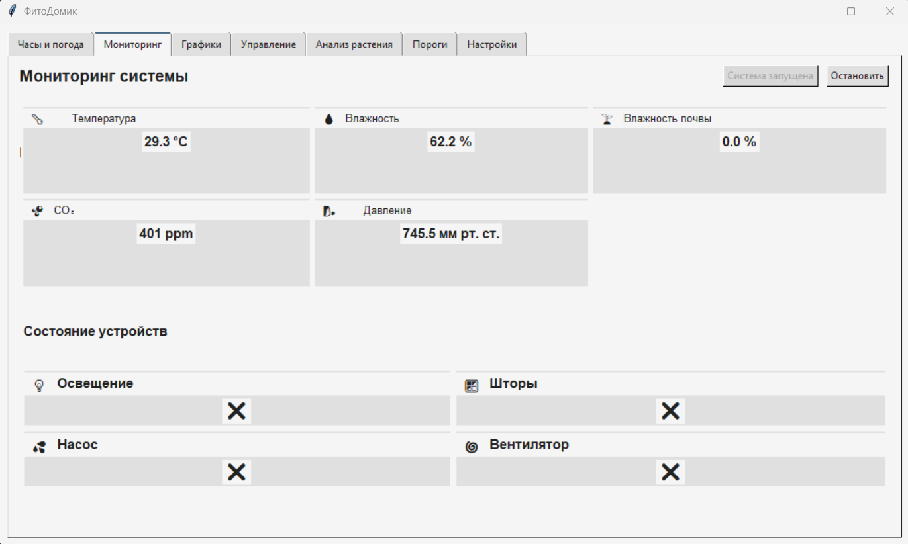
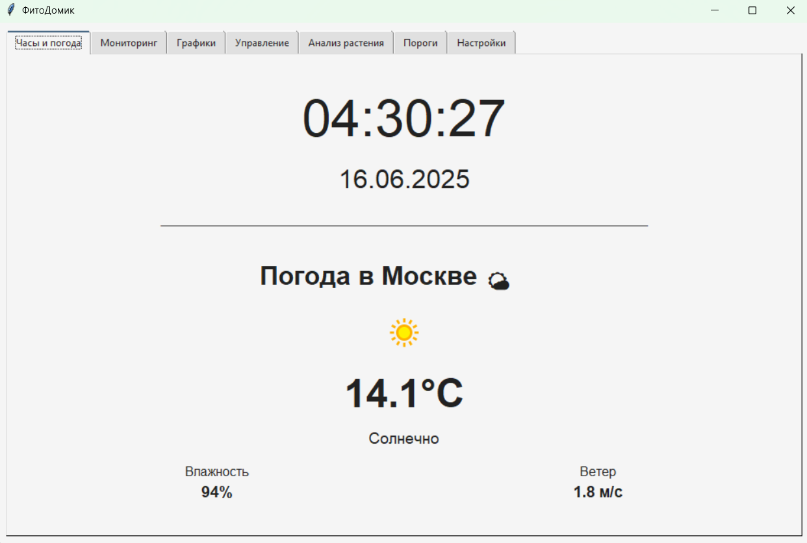
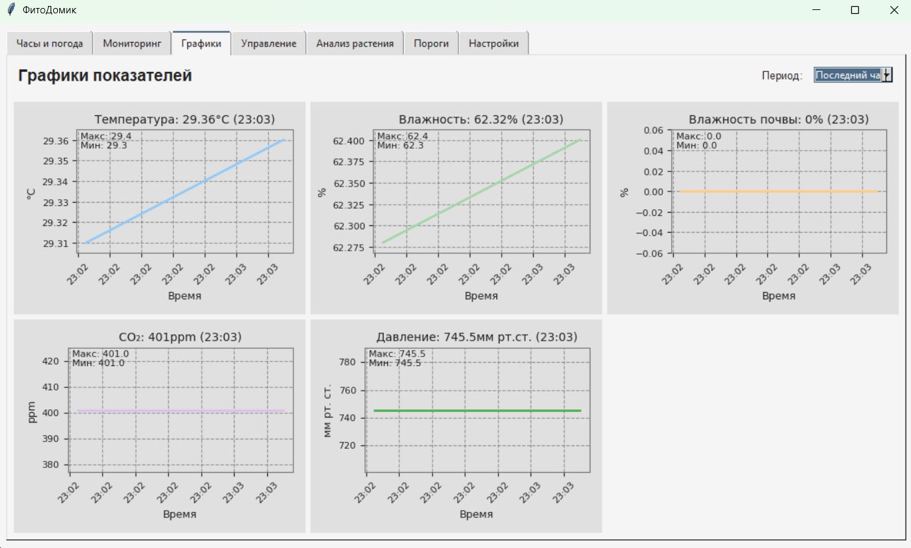
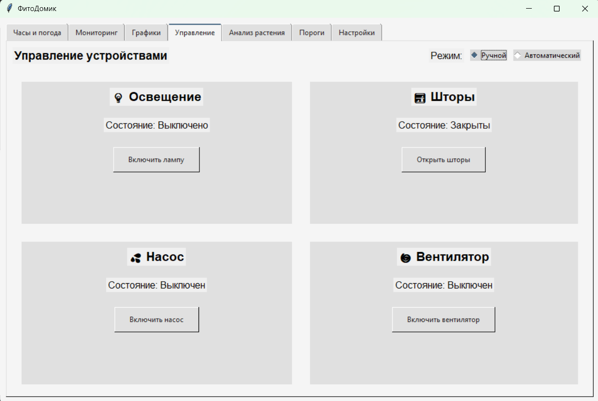
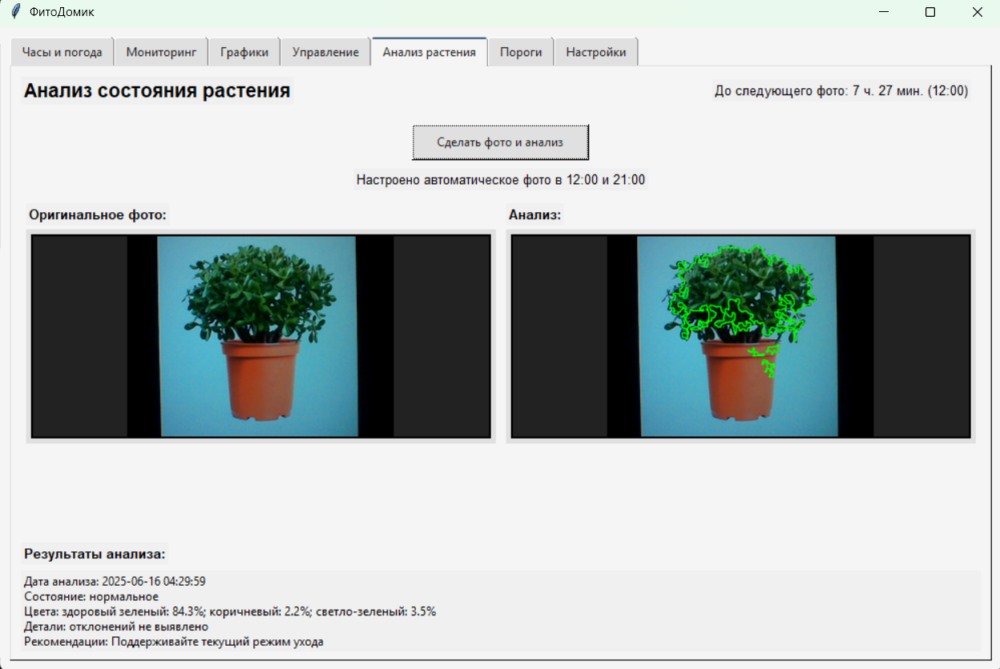
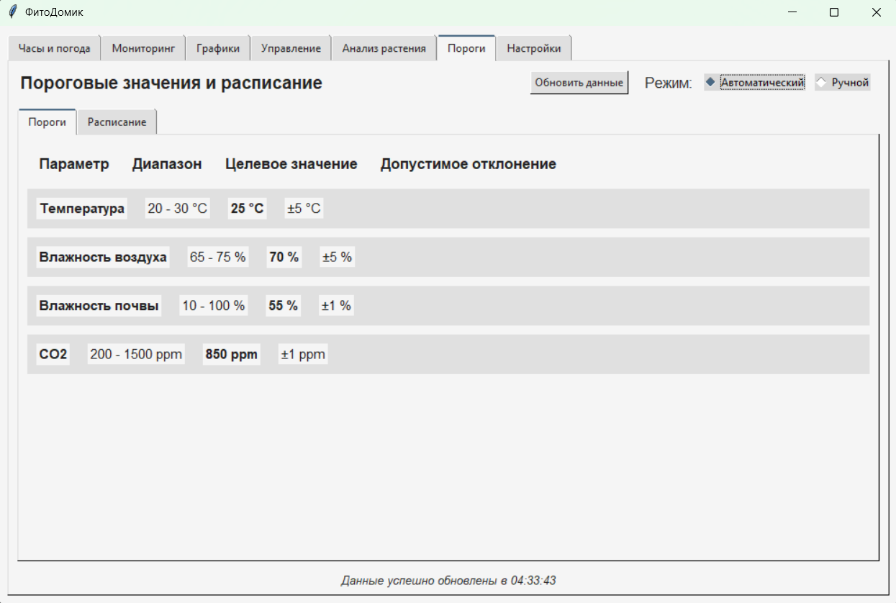
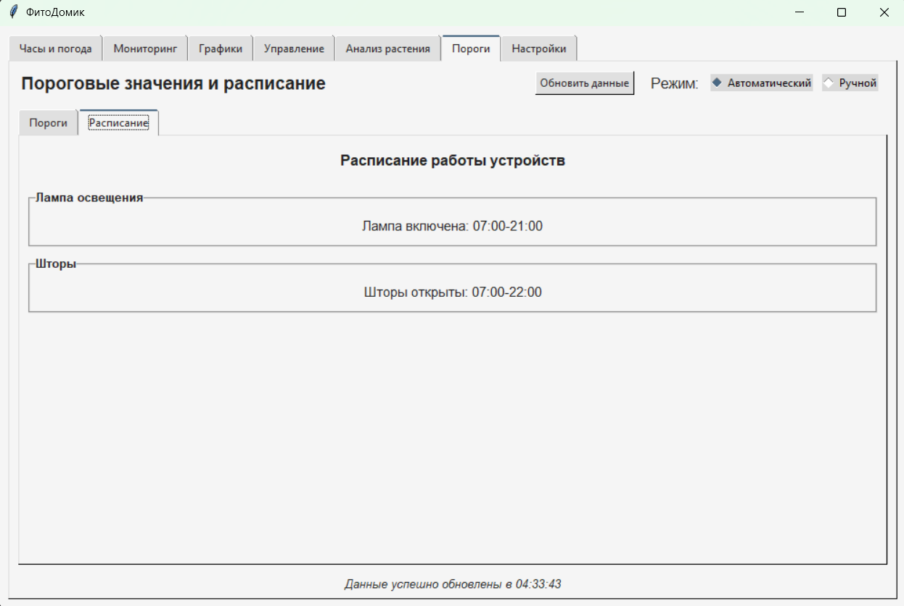
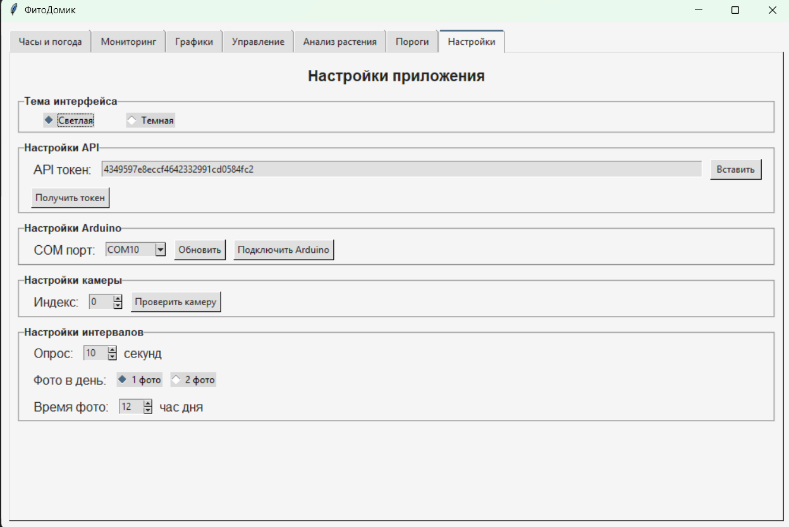

# 🌱 ФитоДомик



## 📋 О проекте

**ФитоДомик** — это умная система для автоматизации ухода за домашними растениями. Проект объединяет аппаратную часть на базе Arduino с программным обеспечением на Python для создания интеллектуальной теплицы, которая:

- Мониторит условия выращивания (влажность, температуру, освещенность)
- Автоматически управляет поливом, освещением, вентиляцией
- Анализирует состояние растений с помощью машиного зрения
- Предоставляет наглядную визуализацию данных и удобный интерфейс управления

Идеально подходит для любителей растений, которые хотят автоматизировать уход за своими зелеными питомцами и создать оптимальные условия для их роста.

## 📑 Содержание

1. [Структура проекта](#структура-проекта)
2. [Описание файлов](#описание-файлов)
3. [Архитектура проекта](#архитектура-проекта)
4. [Используемые библиотеки](#используемые-библиотеки)
5. [Ключевые архитектурные решения](#ключевые-архитектурные-решения)
6. [Диаграммы проекта](#диаграммы-проекта)
7. [Скриншоты интерфейса](#скриншоты-интерфейса)

## 📁 Структура проекта

```
ФитоДомик/
│
├── fitodomik.py         # Основной файл приложения
├── settings.json        # Файл с настройками приложения
├── README.md            # Документация проекта
├── fitodomik.exe        # Приложение exe
├──fitodomik&logging.py  # Программа с системой логирования
├──fitodomik.apk         # Фитодомик — APK-приложение для Android (удобная альтернатива сайту для управления) 
│
├── fitodomik.ino      # Код для Arduino
│
├── foto/              # Директория с изображениями интерфейса
│   ├── screen1v1.png  # Скриншот экрана часы и погода
│   ├── screen2v1.png  # Скриншот экрана мониторинга
│   ├── screen3v1.png  # Скриншот экрана графиков
│   ├── screen4v1.png  # Скриншот экрана управления
│   ├── screen5v1.png  # Скриншот экрана анализа растения
│   ├── screen6v1.png  # Скриншот экрана порогов (автоматический режим)
│   ├── screen6v2.png  # Скриншот экрана порогов (ручной режим)
│   └── screen7v1.png  # Скриншот экрана настроек
│
└── fitodomilsvg/      # Директория с SVG-диаграммами проекта
    ├── structure.svg  # Диаграмма структуры проекта
    ├── dependencies.svg # Диаграмма зависимостей компонентов
    └── functions_used.svg # Диаграмма использования функций
```

## 📄 Описание файлов

### fitodomik.py

**Назначение**: Основной файл приложения, содержащий весь код системы "ФитоДомик".

**Основные классы**:

1. **PlantAnalyzer** - Класс для анализа состояния растений с помощью компьютерного зрения
   - Методы для захвата изображений с камеры
   - Методы для обнаружения растений и анализа их здоровья
   - Отправка данных анализа на сервер

2. **SensorHistory** - Класс для хранения истории показаний датчиков
   - Хранение временных рядов данных с датчиков
   - Ограничение максимального количества точек данных

3. **ArduinoHandler** - Класс для взаимодействия с Arduino через COM-порт
   - Подключение к Arduino
   - Получение данных с датчиков
   - Отправка команд управления устройствами

4. **DataSender** - Класс для отправки данных на сервер
   - Отправка показаний датчиков
   - Работа с API сервера

5. **ThresholdManager** - Класс для управления пороговыми значениями
   - Получение пороговых значений с сервера
   - Форматирование данных для отображения
   - Работа с расписанием

6. **FitoDomikApp** - Главный класс приложения
   - Инициализация интерфейса
   - Управление вкладками
   - Обработка пользовательского ввода
   - Управление настройками
   - Автоматический и ручной режимы работы

**Принцип работы**:
Файл реализует полнофункциональное приложение с графическим интерфейсом для мониторинга и управления системой "ФитоДомик". Приложение подключается к Arduino через COM-порт, получает данные с датчиков, отображает их в реальном времени, строит графики, анализирует состояние растений с помощью компьютерного зрения и отправляет данные на сервер. Также реализована возможность автоматического управления устройствами (лампой, шторами, насосом, вентилятором) на основе показаний датчиков и заданных пороговых значений.

### settings.json

**Назначение**: Хранение настроек приложения.

**Основные параметры**:
- Тема интерфейса
- API-токен для доступа к серверу
- COM-порт для подключения к Arduino
- Интервалы опроса датчиков и отправки данных
- Режимы управления и пороговых значений
- Настройки камеры и фотосъемки
- Пользовательские пороговые значения и расписания

## 🏗️ Архитектура проекта

Проект "ФитоДомик" построен на основе объектно-ориентированного подхода и имеет модульную архитектуру:

1. **Графический интерфейс** — Построен на Tkinter, разделен на функциональные вкладки
2. **Система мониторинга** — Получение и визуализация данных с датчиков
3. **Система управления** — Ручной и автоматический режимы работы устройств
4. **Система анализа растений** — Компьютерное зрение для оценки состояния растений
5. **Система работы с сервером** — Обмен данными с облачным сервисом
6. **Система настроек** — Управление параметрами работы приложения

## 📚 Используемые библиотеки

1. **Tkinter** — Графический интерфейс
2. **PySerial** — Работа с COM-портами
3. **Matplotlib** — Построение графиков
4. **NumPy** — Обработка данных
5. **PIL (Pillow)** — Работа с изображениями
6. **OpenCV (cv2)** — Компьютерное зрение
7. **Requests** — HTTP-запросы
8. **Стандартные библиотеки Python** — json, datetime, threading, os, re, io, collections.deque, webbrowser

## 🧩 Ключевые архитектурные решения

1. **Модульная архитектура** — Разделение функциональности на отдельные классы
2. **Многопоточность** — Параллельная работа мониторинга, анализа и управления
3. **Гибкие режимы работы** — Автоматический и ручной режимы управления
4. **Персистентность настроек** — Сохранение всех настроек в JSON-файл
5. **Компьютерное зрение** — Анализ состояния растений по изображениям
6. **Визуализация данных** — Интерактивные графики с историей показаний
7. **Интеграция с внешними системами** — Arduino, облачный сервер, API погоды

## 📊 Диаграммы проекта

### Структура проекта


### Диаграмма зависимостей компонентов


### Диаграмма использования функций


## 📱 Скриншоты интерфейса

### Экран 1: Часы и погода


### Экран 2: Мониторинг


### Экран 3: Графики


### Экран 4: Управление устройствами


### Экран 5: Анализ растения


### Экран 6: Пороги (автоматический режим)


### Экран 6: Пороги (ручной режим)


### Экран 7: Настройки



# 🍓 Руководство по установке и настройке Raspberry Pi

## 🚀 Быстрая установка ФитоДомик

### Установка одной командой:
```bash
curl -sSL https://raw.githubusercontent.com/FitoDomik/FitoDomik_project/main/install.sh | bash
```

После установки приложение будет доступно в папке `~/Downloads/fitodomik.py`

## 📋 Содержание
- [Быстрая установка ФитоДомик](#-быстрая-установка-фитодомик)
- [Установка операционной системы](#установка-операционной-системы)
- [Установка Python](#установка-python)
- [Установка pip](#установка-pip)
- [Установка библиотек](#установка-библиотек)
- [Настройка автозапуска](#настройка-автозапуска)

---

## 🖥️ Установка операционной системы

### Шаг 1: Подготовка
1. Скачайте **Raspberry Pi Imager** с официального сайта:
   - [Raspberry Pi OS – Raspberry Pi](https://www.raspberrypi.com/software/)

### Шаг 2: Запись образа
1. Запустите **Raspberry Pi Imager**
2. Выберите вашу плату Raspberry Pi
3. Выберите **Raspberry Pi OS (64-bit)**
4. Выберите подключенную SD карту
5. Нажмите **"Записать"** и дождитесь завершения

---

## 🐍 Установка Python

### Способ 1: Установка через pyenv (рекомендуемый)

#### 1. Обновление системы
```bash
sudo apt update && sudo apt upgrade -y
```

#### 2. Установка зависимостей
```bash
sudo apt install -y make build-essential libssl-dev zlib1g-dev \
libbz2-dev libreadline-dev libsqlite3-dev wget curl llvm \
libncurses5-dev libncursesw5-dev xz-utils tk-dev libffi-dev \
liblzma-dev python3-openssl git
```

#### 3. Установка pyenv
```bash
curl https://pyenv.run | bash
```

#### 4. Настройка PATH
```bash
echo 'export PYENV_ROOT="$HOME/.pyenv"' >> ~/.bashrc
echo 'command -v pyenv >/dev/null || export PATH="$PYENV_ROOT/bin:$PATH"' >> ~/.bashrc
echo 'eval "$(pyenv init -)"' >> ~/.bashrc
```

#### 5. Перезагрузка терминала
```bash
source ~/.bashrc
```

#### 6. Установка Python 3.13.5
```bash
pyenv install 3.13.5
pyenv global 3.13.5
```

#### 7. Проверка установки
```bash
python --version
```

---

## 📦 Установка pip

### Проверка установки
```bash
python -m pip --version
```

### Установка pip (если не установлен)
```bash
python -m ensurepip --upgrade
```

### Альтернативный способ установки
```bash
curl https://bootstrap.pypa.io/get-pip.py -o get-pip.py
python get-pip.py
```

### Обновление pip
```bash
python -m pip install --upgrade pip
```

---

## 📚 Установка библиотек (обязательно!)

### Установка всех библиотек одной командой
```bash
python -m pip install --upgrade pip
python -m pip install pyserial pillow matplotlib numpy requests opencv-python urllib3
```

### Установка по отдельности
```bash
# Основные библиотеки
python -m pip install pyserial          # для работы с serial
python -m pip install pillow            # для PIL (Image, ImageTk)
python -m pip install matplotlib        # для графиков
python -m pip install numpy             # для работы с массивами
python -m pip install requests          # для HTTP запросов
python -m pip install opencv-python     # для cv2
python -m pip install urllib3           # для работы с URL
```

---

## 🚀 Настройка автозапуска

### Создание автозапуска через Desktop Entry

#### 1. Создание директории автозапуска
```bash
mkdir -p /home/user/.config/autostart
```

#### 2. Создание файла автозапуска
```bash
nano /home/user/.config/autostart/fitodomik.desktop
```

#### 3. Содержимое файла автозапуска
```ini
[Desktop Entry]
Type=Application
Name=Fitodomik
Comment=Автозапуск приложения Fitodomik
Exec=/usr/bin/python3 /home/user/Downloads/fitodomik.py
Icon=applications-python
Terminal=false
Hidden=false
X-GNOME-Autostart-enabled=true
StartupNotify=false
```

#### 4. Установка прав на выполнение
```bash
chmod +x /home/user/.config/autostart/fitodomik.desktop
```

#### 5. Добавление shebang в Python-скрипт
```bash
nano /home/user/Downloads/fitodomik.py
```

Добавьте в самое начало файла:
```python
#!/usr/bin/python3
```

#### 6. Установка прав на выполнение для скрипта
```bash
chmod +x /home/user/Downloads/fitodomik.py
```

### Как это работает
- ✅ При загрузке Raspberry Pi автоматически запустится ваше приложение
- ✅ Приложение откроется в отдельном окне
- ✅ Рабочий стол останется доступным
- ✅ Вы сможете свернуть/закрыть приложение и работать с другими программами
- ✅ При закрытии приложения оно не будет перезапускаться автоматически до следующей перезагрузки

### Проверка автозапуска
```bash
sudo reboot
```

После перезагрузки ваше приложение должно запуститься автоматически, но рабочий стол останется полностью функциональным.

---

## 🎯 Готово!

Теперь у вас установлена и настроена система Raspberry Pi с Python 3.13.5, всеми необходимыми библиотеками и настроенным автозапуском приложения.

### Полезные команды для проверки
```bash
# Проверка версии Python
python --version

# Проверка установленных пакетов
pip list

# Проверка автозапуска
ls -la ~/.config/autostart/
```
---

*📝 Примечание: Замените `/home/user/` на ваш путь к пользователю.* 

# 🌱 Проект **ФитоДомик**

⭐ **Основной репозиторий проекта ФитоДомик**  
[👉 GitHub: FitoDomik_project](https://github.com/FitoDomik/FitoDomik_project)

📌 **Сайт-визитка проекта**  
[👉 GitHub: fitodomik.ru](https://github.com/FitoDomik/fitodomik.ru)

💻 **Сайт для управления умной фермой**  
[👉 GitHub: fitodomik.online](https://github.com/FitoDomik/fitodomik.online)

