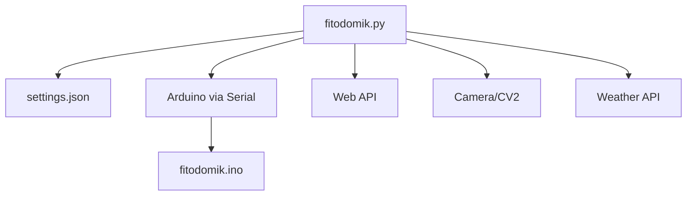
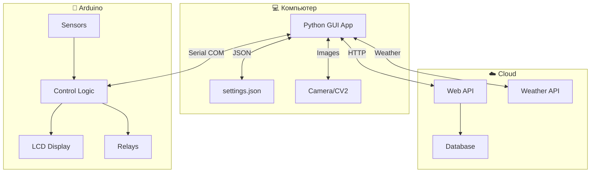
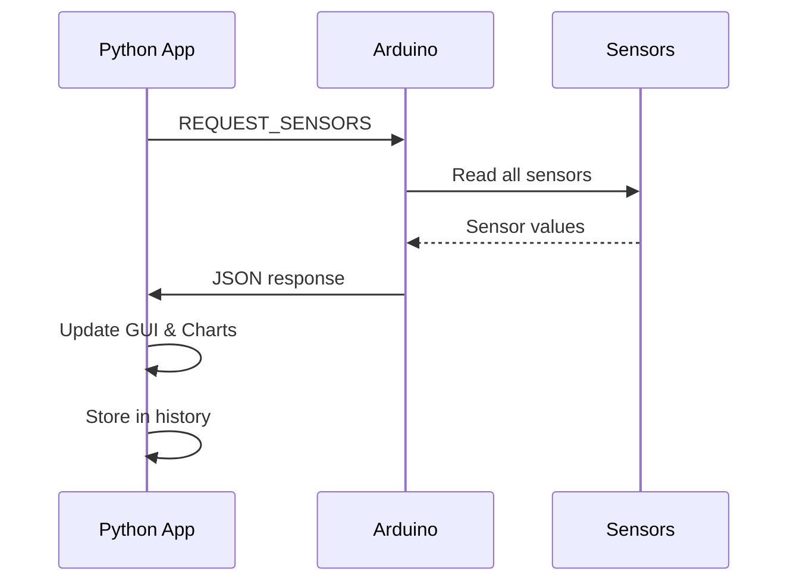
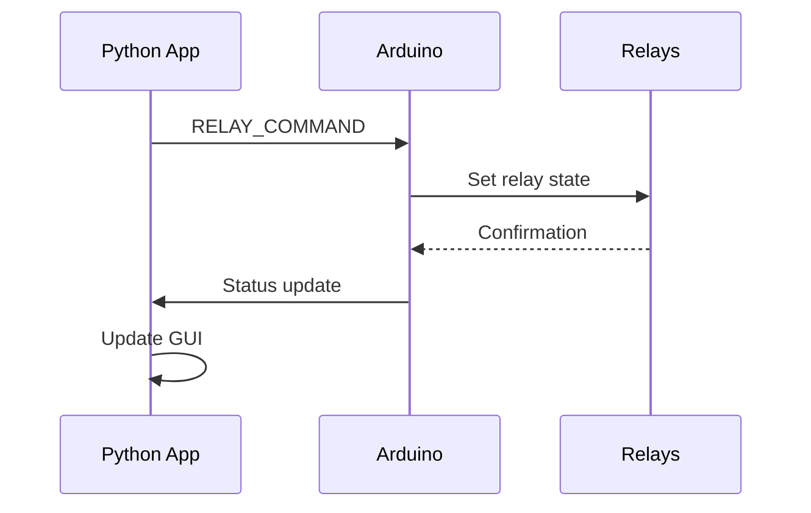
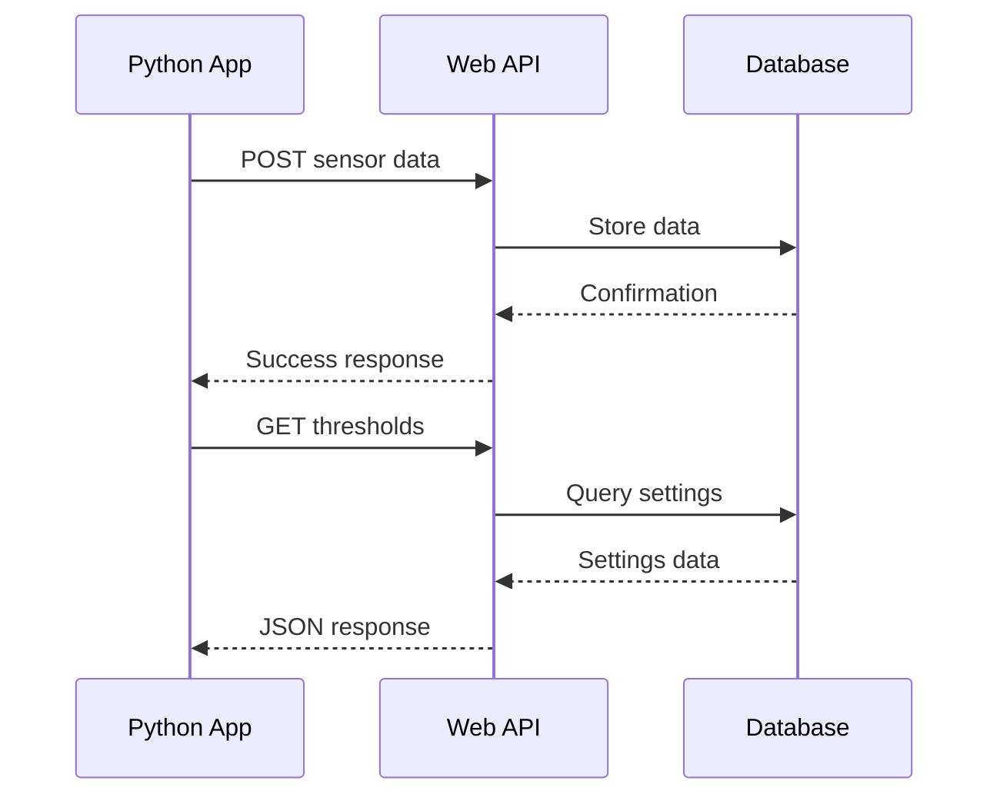
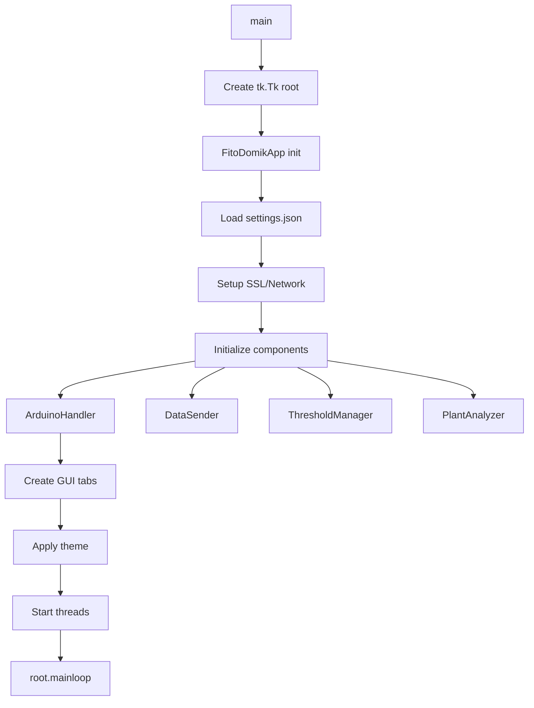
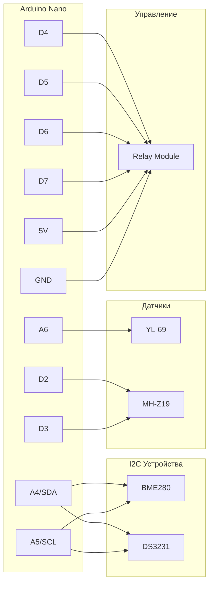

# 🌱 ФитоДомик - Система умного сельского хозяйства


**ФитоДомик** - это комплексная система автоматизированного мониторинга и управления для умного сельского хозяйства, объединяющая Arduino-контроллер, Python-приложение с графическим интерфейсом и веб-API для удаленного мониторинга.


https://user-images.githubusercontent.com/your-username/your-repo/raw/main/fitodomik/foto/program_site.mp4

<video width="100%" controls>
  <source src="foto/program_site.mp4" type="video/mp4">
  Ваш браузер не поддерживает воспроизведение видео.
</video>

*Полная демонстрация системы с мониторингом в реальном времени, управлением устройствами и анализом растений*

> 🌍 **[English version available](README_EN.md)** | **[Русская версия](README.md)**

---

## 📑 Оглавление

0. [🎥 Демо видео](#-демо-видео)
1. [📁 Структура проекта](#-1-структура-проекта)
2. [📋 Описание файлов](#-2-описание-файлов)
3. [🏗️ Архитектура проекта](#️-3-архитектура-проекта)
4. [📚 Библиотеки и фреймворки](#-4-библиотеки-и-фреймворки)
5. [🚀 Точка входа и запуск](#-5-точка-входа-и-запуск)
6. [🎯 Архитектурные особенности](#-6-архитектурные-особенности)
7. [⚡ Установка зависимостей](#-7-установка-зависимостей)
8. [🔌 Схема подключения Arduino](#-8-схема-подключения-arduino)
9. [🎮 Использование](#-9-использование)
10. [❓ FAQ и отладка](#-10-faq-и-отладка)
11. [📱 Скриншоты интерфейса](#-11-скриншоты-интерфейса)

---

## 📁 1. Структура проекта

```
fitodomik/
├── 📱 fitodomik.py         # Основное Python приложение (GUI)
├── 🤖 fitodomik.ino        # Arduino прошивка
├── ⚙️ settings.json        # Файл настроек приложения
├── 📄 README.md           # Документация проекта (русский)
├── 📄 README_EN.md        # Документация проекта (английский)
├── 📋 1.md               # Схема подключения компонентов
├── 📋 requirements.txt    # Python зависимости
├── 📁 libraries/          # Arduino библиотеки
│   ├── Adafruit_BME280_Library/
│   ├── Adafruit_sensor/
│   ├── RTClib-master/
│   └── mhz19_uart/
└── 📁 foto/               # Скриншоты и видео
    ├── screen1v1.png
    ├── screen2v1.png
    ├── ...
    └── program_site.mp4
```

### Дерево зависимостей:


---

## 📋 2. Описание файлов

### 🐍 **fitodomik.py** (2,702 строки)
**Назначение:** Основное графическое приложение для мониторинга и управления системой

#### **Ключевые классы:**
- **`FitoDomikApp`** - Главный класс приложения (GUI)
- **`ArduinoHandler`** - Обработчик связи с Arduino
- **`PlantAnalyzer`** - Анализ состояния растений через камеру
- **`DataSender`** - Отправка данных на сервер
- **`ThresholdManager`** - Управление пороговыми значениями
- **`SensorHistory`** - Хранение истории показаний датчиков

#### **Ключевые функции:**
- Графический интерфейс с вкладками (tkinter)
- Мониторинг датчиков в реальном времени
- Построение графиков (matplotlib)
- Анализ изображений растений (OpenCV)
- Автоматическое управление устройствами
- Отправка данных в облако

#### **Связи:**
- 🔗 Последовательная связь с Arduino (COM порт)
- 🔗 HTTP API для отправки данных на сервер
- 🔗 Загрузка настроек из `settings.json`
- 🔗 Weather API для получения погоды

#### **Логика работы:**
1. Инициализация GUI и компонентов
2. Подключение к Arduino через COM порт
3. Циклический опрос датчиков
4. Обновление интерфейса и графиков
5. Автоматическое управление реле по расписанию/порогам
6. Периодическая отправка данных на сервер

---

### 🤖 **fitodomik.ino** (292 строки)
**Назначение:** Прошивка Arduino для сбора данных с датчиков и управления устройствами

#### **Ключевые компоненты:**
- **BME280** - Датчик температуры, влажности, давления
- **MH-Z19** - Датчик CO₂
- **YL-69** - Датчик влажности почвы
- **RTC DS3231** - Часы реального времени
- **4x реле** - Управление устройствами (лампа, шторы, насос, вентилятор)

#### **Ключевые функции:**
```cpp
void readSensors()        // Чтение всех датчиков
void autoControlRelays()  // Автоматическое управление реле
void controlBySchedule()  // Управление по расписанию
void processCommand()     // Обработка команд с компьютера
void sendSerialData()     // Отправка данных по Serial
```

#### **Структуры данных:**
- **`SensorData`** - Текущие показания датчиков
- **`ThresholdData`** - Пороговые значения для автоуправления
- **`ScheduleData`** - Расписание работы устройств

#### **Связи:**
- 🔗 Serial связь с компьютером (9600 baud)
- 🔗 I2C подключение датчиков
- 🔗 GPIO управление реле

#### **Логика работы:**
1. Инициализация датчиков
2. Циклическое чтение датчиков (каждые 2 сек)
3. Отправка данных по Serial
4. Автоматическое управление реле (каждые 10 сек)
5. Обработка команд от компьютера через Serial

---

### ⚙️ **settings.json** (14 строк)
**Назначение:** Файл конфигурации приложения

#### **Параметры:**
```json
{
    "theme": "light",           // Тема интерфейса
    "token": "...",              // API токен для сервера
    "port": "COM...",            // COM порт Arduino
    "polling_interval": 5,      // Интервал опроса (сек)
    "data_send_interval": 300,  // Интервал отправки данных (сек)
    "photo_time": 12,          // Время автофото
    "control_mode": "auto",     // Режим управления
    "thresholds_mode": "auto",  // Режим порогов
    "camera_index": 0,         // Индекс камеры
    "photo_count": 1,          // Количество фото в день
    "manual_thresholds": {},    // Ручные пороги
    "manual_schedule": {}       // Ручное расписание
}
```

#### **Связи:**
- 🔗 Загружается при старте `fitodomik.py`
- 🔗 Автоматически сохраняется при изменении настроек

---

## 🏗️ 3. Архитектура проекта

### **Общая структура:**
Система построена по принципу **"клиент-сервер-устройство"** с тремя основными компонентами:



### **Потоки данных:**

#### **1. Сбор данных (Arduino → Python):**


#### **2. Управление устройствами (Python → Arduino):**


#### **3. Облачная синхронизация:**


---

## 📚 4. Библиотеки и фреймворки

### **Python зависимости:**

| Библиотека | Назначение | Использование |
|------------|------------|---------------|
| **tkinter** | GUI фреймворк | Основной интерфейс приложения |
| **matplotlib** | Построение графиков | Визуализация данных датчиков |
| **opencv-cv2** | Компьютерное зрение | Анализ изображений растений |
| **PIL (Pillow)** | Обработка изображений | Работа с фото для GUI |
| **requests** | HTTP клиент | API запросы к серверу |
| **pyserial** | Последовательная связь | Связь с Arduino |
| **numpy** | Математические операции | Обработка данных графиков |
| **threading** | Многопоточность | Фоновые задачи |

### **Arduino библиотеки:**

| Библиотека | Назначение | Устройство |
|------------|------------|------------|
| **Wire.h** | I2C протокол | Связь с датчиками |
| **Adafruit_BME280** | Датчик BME280 | Температура, влажность, давление |
| **MHZ19_uart** | Датчик MH-Z19 | Измерение CO₂ |
| **RTClib** | RTC DS3231 | Часы реального времени |

---

## 🚀 5. Точка входа и запуск

### **Запуск Python приложения:**
```bash
python fitodomik.py
```

### **Последовательность инициализации:**



### **Что выполняется первым:**

1. **📂 Загрузка настроек** из `settings.json`
2. **🔐 Настройка SSL** для HTTPS запросов
3. **🎨 Инициализация GUI** (7 вкладок)
4. **🤖 Подключение к Arduino** (после настройки)
5. **📊 Запуск фоновых потоков**:
   - Мониторинг датчиков
   - Отправка данных на сервер
   - Обновление времени и погоды
6. **🔄 Главный цикл** tkinter

### **Arduino последовательность:**

```cpp
void setup() {
    Serial.begin(9600);          // 1. Инициализация Serial
    initializeRelays();          // 2. Настройка реле
    initializeSensors();         // 3. Инициализация датчиков
    initializeRTC();            // 4. Настройка часов
}

void loop() {
    readSensors();              // Чтение датчиков
    sendSerialData();           // Отправка данных
    processSerialCommands();    // Обработка команд
    autoControlRelays();        // Автоуправление
    controlBySchedule();        // Управление по расписанию
}
```

---

## 🎯 6. Архитектурные особенности

### **🔧 Нестандартные решения:**

#### **1. Многопоточная архитектура в GUI:**
```python
# Фоновые потоки для предотвращения зависания интерфейса
self.update_time_thread = threading.Thread(target=self.update_time_loop, daemon=True)
self.monitoring_thread = threading.Thread(target=self._monitoring_loop, daemon=True)
self.sending_thread = threading.Thread(target=self._sender_thread_loop, daemon=True)
```

**Причина:** Tkinter однопоточный, фоновые задачи могут заморозить GUI.

#### **2. Кроссплатформенный полноэкранный режим:**
```python
try:
    self.root.state('zoomed')  # Windows
except:
    try:
        self.root.attributes('-zoomed', True)  # Linux
    except:
        # Fallback для любой ОС
        screen_width = self.root.winfo_screenwidth()
        screen_height = self.root.winfo_screenheight()
        self.root.geometry(f"{screen_width}x{screen_height}+0+0")
```

**Причина:** Различия в поддержке полноэкранного режима между Windows и Linux.

#### **3. Очередь отправки данных:**
```python
def _sender_thread_loop(self):
    while self.sending_active:
        if self.sending_queue:
            data = self.sending_queue.pop(0)
            self._send_data_internal(*data)
```

**Причина:** Предотвращение потери данных при сбоях сети.

#### **4. Двойной режим управления (авто/ручной):**
```python
if self.control_mode.get() == "auto":
    self.start_auto_mode()  # Автоматическое управление по порогам
else:
    # Ручное управление через GUI
```

**Причина:** Гибкость использования системы.

#### **5. Graceful degradation для датчиков:**
```python
try:
    temp = float(self.arduino.temperature)
except (ValueError, TypeError):
    temp = self.last_valid_temp  # Использовать последнее валидное значение
```

**Причина:** Стабильность работы при сбоях датчиков.

### **🎨 Выбор архитектуры:**

#### **Почему Arduino + Python:**
- ✅ **Arduino**: Надежность, real-time управление, простота подключения датчиков
- ✅ **Python**: Богатые GUI библиотеки, легкость разработки, машинное обучение для анализа растений
- ✅ **Serial связь**: Простота, надежность, переносимость

#### **Почему tkinter вместо Qt/GTK:**
- ✅ **Встроен в Python** (нет дополнительных зависимостей)
- ✅ **Кроссплатформенность** из коробки
- ✅ **Легкость разработки** для прототипа
- ✅ **Малый размер** приложения

#### **Почему JSON для настроек:**
- ✅ **Человекочитаемый** формат
- ✅ **Встроенная поддержка** в Python
- ✅ **Легкость отладки** и ручного редактирования

#### **Архитектурные принципы:**
- 🎯 **Модульность**: Каждый класс отвечает за свою область
- 🔄 **Асинхронность**: Фоновые потоки для тяжелых операций
- 🛡️ **Отказоустойчивость**: Graceful handling ошибок
- 🔧 **Конфигурируемость**: Все настройки в JSON файле
- 📊 **Наблюдаемость**: Детальное логирование и мониторинг

---

## ⚡ 7. Установка зависимостей

### **🐍 Python зависимости:**

#### **Создание requirements.txt:**
```bash
# Создайте файл requirements.txt со следующим содержимым:
```

```txt
# requirements.txt
matplotlib>=3.7.0
opencv-python>=4.8.0
Pillow>=10.0.0
requests>=2.31.0
pyserial>=3.5
numpy>=1.24.0
urllib3>=2.0.0
```

#### **Установка:**
```bash
# Установка через pip:
pip install -r requirements.txt

# Или установка отдельно:
pip install matplotlib opencv-python Pillow requests pyserial numpy urllib3
```

#### **Для Linux (дополнительно):**
```bash
# Ubuntu/Debian:
sudo apt-get update
sudo apt-get install python3-tk python3-dev

# Arch Linux:
sudo pacman -S tk python-tkinter
```

### **🤖 Arduino библиотеки:**

#### **📦 Установка из папки проекта (рекомендуется):**
В проекте уже есть все необходимые библиотеки в папке `libraries/`:

1. **Скопируйте все папки** из `fitodomik/libraries/` в папку библиотек Arduino:
   ```bash
   # Windows:
   copy fitodomik\libraries\* %USERPROFILE%\Documents\Arduino\libraries\
   
   # Linux/Mac:
   cp -r fitodomik/libraries/* ~/Arduino/libraries/
   ```

2. **Перезапустите Arduino IDE** чтобы библиотеки подгрузились

#### **📚 Список включенных библиотек:**
- **Adafruit_BME280_Library** - датчик BME280
- **Adafruit_sensor** - базовые сенсоры Adafruit
- **RTClib-master** - часы реального времени DS3231
- **mhz19_uart** - датчик CO₂ MH-Z19

#### **🔄 Альтернативная установка через Library Manager:**
Если папка `libraries/` недоступна, установите через Arduino IDE:
1. Откройте **Arduino IDE**
2. Перейдите в **Tools → Manage Libraries**
3. Найдите и установите:
   ```
   - Adafruit BME280 Library (by Adafruit)
   - MH-Z19 (by WifWaf)
   - RTClib (by Adafruit)
   ```

### **🔍 Проверка установки:**

#### **Python:**
```python
# Тест import'ов:
python -c "import tkinter, matplotlib, cv2, PIL, requests, serial, numpy; print('✅ Все библиотеки установлены')"
```

#### **Arduino:**
Скомпилируйте `fitodomik.ino` - если нет ошибок, все библиотеки установлены правильно.

---

## 🔌 8. Схема подключения Arduino

### **📋 Компоненты системы:**
- **Arduino Nano** (ATMega328)
- **BME280** - датчик температуры, влажности и давления
- **MH-Z19** - датчик CO₂ (углекислого газа)
- **YL-69 (FC-28)** - датчик влажности почвы
- **DS3231** - часы реального времени
- **4CH Relay Module** - модуль управления реле

### **🔌 Схема подключения:**



### **📊 Детальная схема:**

#### **🌡️ BME280 (I2C)**
| BME280 | Arduino Nano |
|--------|--------------|
| VCC    | 3.3V         |
| GND    | GND          |
| SDA    | A4           |
| SCL    | A5           |

#### **⏰ DS3231 (I2C)**
| DS3231 | Arduino Nano |
|--------|--------------|
| VCC    | 5V           |
| GND    | GND          |
| SDA    | A4           |
| SCL    | A5           |

#### **💧 YL-69 (FC-28)**
| YL-69  | Arduino Nano |
|--------|--------------|
| VCC    | 5V           |
| GND    | GND          |
| A0     | A6           |

#### **💨 MH-Z19 (UART)**
| MH-Z19 | Arduino Nano |
|--------|--------------|
| VIN    | 5V           |
| GND    | GND          |
| TX     | D3 (SoftwareSerial) |
| RX     | D2 (SoftwareSerial) |

#### **🔌 4CH Relay Module**
| Relay  | Arduino Nano | Устройство  |
|--------|--------------|-------------|
| VCC    | 5V           | -           |
| GND    | GND          | -           |
| IN1    | D7           | Вентилятор  |
| IN2    | D6           | Насос       |
| IN3    | D5           | Шторы       |
| IN4    | D4           | Лампа       |

### **⚠️ Важные примечания:**

#### **Питание:**
- **BME280**: 3.3V (не подключайте к 5V!)
- **Остальные компоненты**: 5V
- **Общий GND**: все устройства должны иметь общий провод земли

#### **I2C адреса:**
- **BME280**: 0x76 или 0x77
- **DS3231**: 0x68

#### **Подтяжка I2C:**
I2C шина требует подтягивающих резисторов 4.7kΩ на линиях SDA и SCL к 5V (обычно встроены в модули).

---

## 🎮 9. Использование

### **🚀 Быстрый старт:**
1. **Соберите схему** согласно разделу "Схема подключения"
2. **Подключите Arduino** к компьютеру через USB
3. **Прошейте** `fitodomik.ino` в Arduino IDE
4. **Установите зависимости**: `pip install -r requirements.txt`
5. **Запустите** `python fitodomik.py`
6. **Настройте COM порт** в вкладке "Настройки"
7. **Нажмите "Подключить Arduino"**
8. **Нажмите "Запустить систему"** в вкладке "Мониторинг"

### **📊 Основные функции:**
- 📈 **Мониторинг** датчиков в реальном времени
- 📋 **Графики** истории показаний
- 🎛️ **Управление** устройствами (ручное/автоматическое)
- 📷 **Анализ растений** через камеру
- ☁️ **Синхронизация** с облачным сервером
- ⚙️ **Настройка** порогов и расписаний

### **🎯 Режимы работы:**

#### **🔄 Автоматический режим:**
- Пороги загружаются с сервера
- Автоматическое управление реле
- Расписание работы устройств

#### **✋ Ручной режим:**
- Пользовательские пороги
- Ручное управление реле
- Настраиваемое расписание

---

## ❓ 10. FAQ и отладка

### **🔧 Частые проблемы и решения:**

#### **❌ Проблема: COM-порт не найден**

**Симптомы:**
- Arduino не отображается в списке портов
- Ошибка подключения к устройству

**Решения:**
```bash
# 1. Проверьте подключение USB кабеля
# 2. Установите драйвера Arduino
# Windows: https://www.arduino.cc/en/Guide/DriverInstallation
# Linux: драйвера обычно встроены

# 3. Проверьте порты в системе:
# Windows:
# Device Manager → Ports (COM & LPT)

# Linux:
ls /dev/tty*
dmesg | grep ttyUSB

# 4. Права доступа (Linux):
sudo usermod -a -G dialout $USER
# Перезагрузите систему после этой команды
```

**Альтернативные методы:**
- Попробуйте другой USB кабель
- Перезагрузите Arduino (кнопка RESET)
- Смените USB порт на компьютере

---

#### **🤖 Проблема: Нет соединения с Arduino**

**Симптомы:**
- Порт найден, но данные не приходят
- Ошибки тайм-аута при отправке команд
- "Arduino не отвечает"

**Решения:**
```python
# 1. Проверьте скорость соединения:
# В коде Arduino: Serial.begin(9600);
# В Python: baudrate=9600

# 2. Сброс Arduino:
# Нажмите кнопку RESET на плате

# 3. Проверьте прошивку:
# Откройте Serial Monitor в Arduino IDE
# Установите 9600 baud
# Должны появиться данные от датчиков
```

**Отладка через Serial Monitor:**
```
Ожидаемый вывод:
{"co2":400,"temp":25.3,"humidity":60.2,"pressure":1013.25,"soil":45,"relay1":false,"relay2":false,"relay3":false,"relay4":false,"time":"12:34:56","date":"01.01.2024"}
```

---

#### **📷 Проблема: Не работает камера**

**Симптомы:**
- Ошибка при инициализации камеры
- Черный экран при съемке
- Приложение зависает при использовании камеры

**Решения:**
```python
# 1. Проверьте индекс камеры:
# В настройках попробуйте значения: 0, 1, 2

# 2. Тест камеры в Python:
import cv2
cap = cv2.VideoCapture(0)  # Попробуйте 0, 1, 2
ret, frame = cap.read()
if ret:
    print("✅ Камера работает")
    cv2.imwrite("test.jpg", frame)
else:
    print("❌ Камера не работает")
cap.release()

# 3. Права доступа (Linux):
sudo usermod -a -G video $USER
# Перезагрузка после команды
```

**Для USB камер:**
- Проверьте подключение USB
- Убедитесь, что камера не используется другим приложением
- Попробуйте другой USB порт

---

#### **🔄 Проблема: Как сбросить настройки**

**Полный сброс:**
```bash
# 1. Удалите файл настроек:
rm settings.json  # Linux/Mac
del settings.json  # Windows

# 2. При следующем запуске создастся новый файл с настройками по умолчанию
```

**Частичный сброс:**
```json
# Отредактируйте settings.json вручную:
{
    "theme": "light",
    "token": "your_token",
    "port": "COM4",  // Измените на ваш порт
    "polling_interval": 5,
    "data_send_interval": 300,
    "photo_time": 12,
    "control_mode": "manual",  // Сброс в ручной режим
    "thresholds_mode": "manual",
    "camera_index": 0,
    "photo_count": 1,
    "manual_thresholds": {},
    "manual_schedule": {}
}
```

---

#### **⚠️ Проблема: Ошибки датчиков Arduino**

**Диагностика датчиков:**
```cpp
// Добавьте отладочный код в Arduino:
void setup() {
    Serial.begin(9600);
    Serial.println("=== Диагностика датчиков ===");
    
    // BME280
    if (!bme.begin(0x76)) {
        Serial.println("❌ BME280 не найден!");
    } else {
        Serial.println("✅ BME280 OK");
    }
    
    // RTC
    if (!rtc.begin()) {
        Serial.println("❌ RTC не найден!");
    } else {
        Serial.println("✅ RTC OK");
    }
}
```

**Проверка I2C устройств:**
```cpp
// Сканер I2C адресов:
#include <Wire.h>

void setup() {
    Wire.begin();
    Serial.begin(9600);
    Serial.println("Сканирование I2C...");
    
    for(byte i = 1; i < 120; i++) {
        Wire.beginTransmission(i);
        if(Wire.endTransmission() == 0) {
            Serial.print("Устройство найдено: 0x");
            Serial.println(i, HEX);
        }
    }
}
```

---

#### **🌐 Проблема: Ошибки сети/API**

**Проверка соединения:**
```python
# Тест API соединения:
import requests

try:
    response = requests.get("https://fitodomik.online/api", timeout=10)
    print(f"✅ API доступен: {response.status_code}")
except requests.exceptions.RequestException as e:
    print(f"❌ Ошибка API: {e}")
```

**Настройка сертификатов:**
```python
# Если проблемы с SSL:
import ssl
ssl._create_default_https_context = ssl._create_unverified_context
```

---

### **🛠️ Логи и отладка:**

#### **Включение подробных логов:**
```python
# В начале fitodomik.py добавьте:
import logging
logging.basicConfig(level=logging.DEBUG, 
                   format='%(asctime)s - %(levelname)s - %(message)s')
```

#### **Мониторинг Serial порта:**
```bash
# Linux/Mac:
cat /dev/ttyUSB0

# Windows (PowerShell):
[System.IO.Ports.SerialPort]::getportnames()
```

---

### **📞 Получение помощи:**

Если проблема не решена:
1. **Проверьте** все подключения по схеме
2. **Попробуйте** примеры из FAQ
3. **Соберите информацию**:
   - Версия ОС
   - Версия Python
   - Модель Arduino
   - Текст ошибки
   - Логи приложения

**🔧 Команда диагностики:**
```bash
python --version
pip list | grep -E "(opencv|matplotlib|serial|requests)"
```

---

## 📱 11. Скриншоты интерфейса

### Экран 1: Часы и погода


### Экран 2: Мониторинг


### Экран 3: Графики


### Экран 4: Управление устройствами


### Экран 5: Анализ растения


### Экран 6: Пороги (автоматический режим)


### Экран 6: Пороги (ручной режим)


### Экран 7: Настройки
