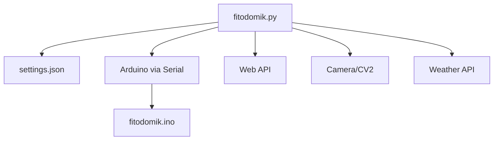
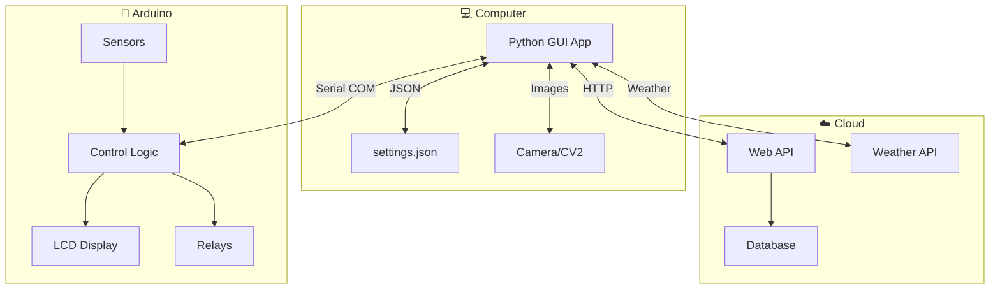
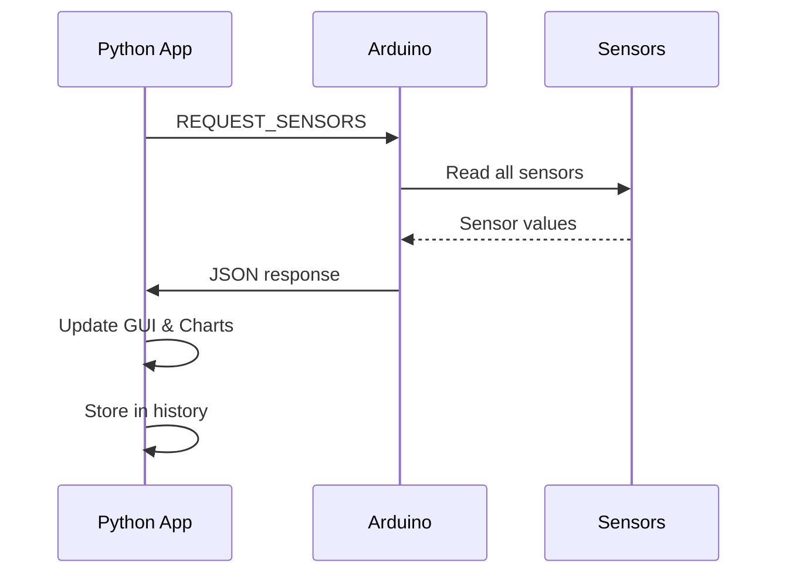
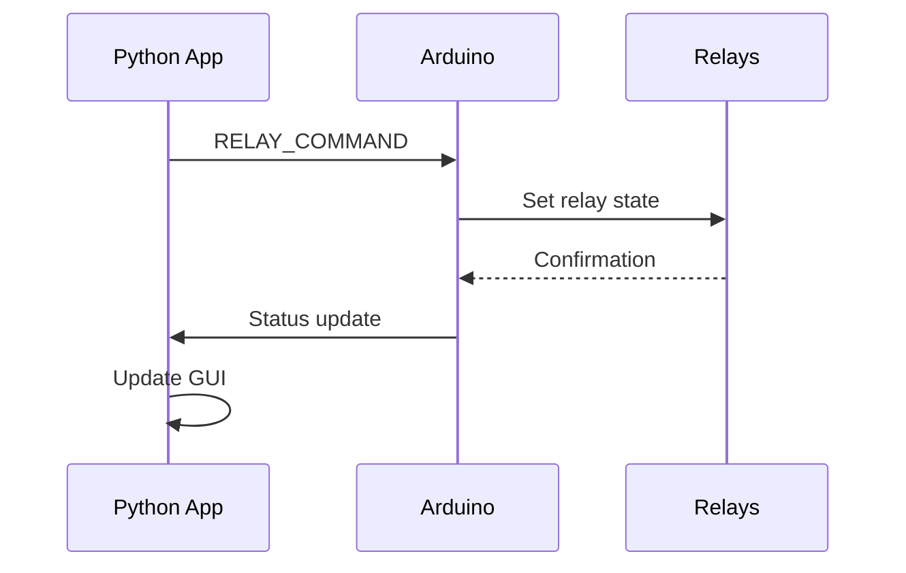
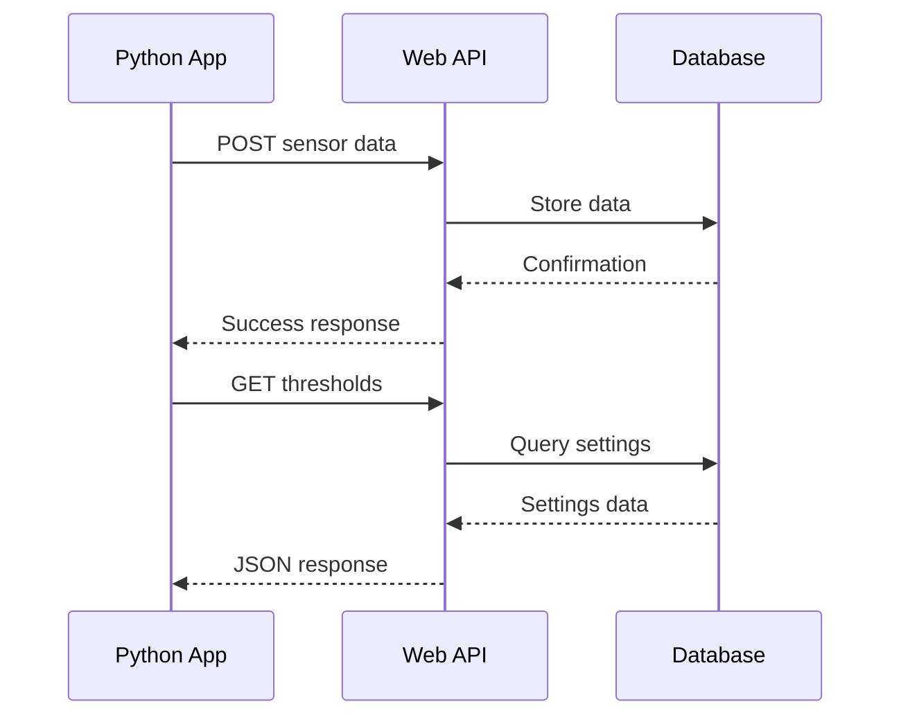
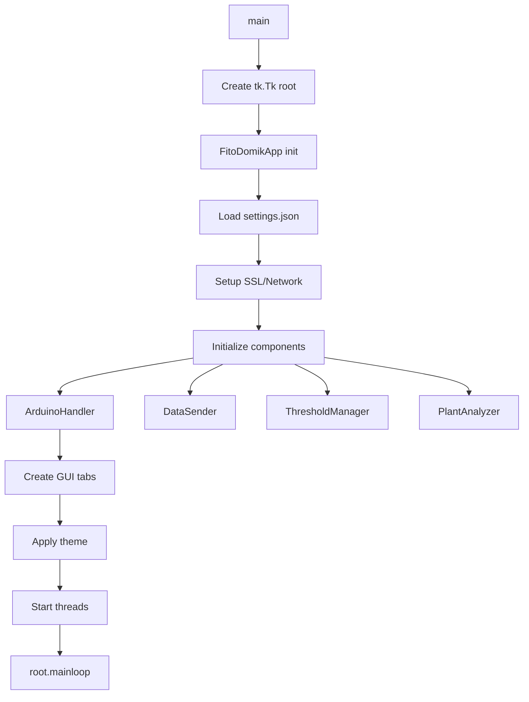
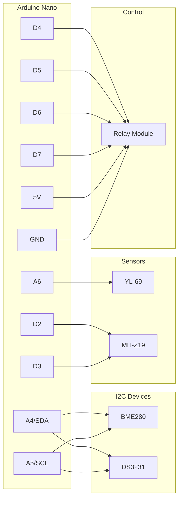

# 🌱 FitoDomik - Smart Agriculture System


**FitoDomik** is a comprehensive automated monitoring and control system for smart agriculture, combining an Arduino controller, Python GUI application, and web API for remote monitoring.

## 🎥 Demo Video

https://user-images.githubusercontent.com/your-username/your-repo/raw/main/fitodomik/foto/program_site.mp4

<video width="100%" controls>
  <source src="foto/program_site.mp4" type="video/mp4">
  Your browser does not support video playback.
</video>

*Complete system demonstration showing real-time monitoring, device control, and plant analysis*

> 🌍 **[English version](README_EN.md)** | **[Русская версия available](README.md)**

---

## 📑 Table of Contents

0. [🎥 Demo Video](#-demo-video)
1. [📁 Project Structure](#-1-project-structure)
2. [📋 File Descriptions](#-2-file-descriptions)
3. [🏗️ Project Architecture](#️-3-project-architecture)
4. [📚 Libraries and Frameworks](#-4-libraries-and-frameworks)
5. [🚀 Entry Point and Launch](#-5-entry-point-and-launch)
6. [🎯 Architectural Features](#-6-architectural-features)
7. [⚡ Dependencies Installation](#-7-dependencies-installation)
8. [🔌 Arduino Wiring Diagram](#-8-arduino-wiring-diagram)
9. [🎮 Usage](#-9-usage)
10. [❓ FAQ and Troubleshooting](#-10-faq-and-troubleshooting)
11. [📱 Interface Screenshots](#-11-interface-screenshots)

---

## 📁 1. Project Structure

```
fitodomik/
├── 📱 fitodomik.py         # Main Python GUI application
├── 🤖 fitodomik.ino        # Arduino firmware
├── ⚙️ settings.json        # Application settings file
├── 📄 README.md           # Project documentation (Russian)
├── 📄 README_EN.md        # Project documentation (English)
├── 📋 1.md               # Component wiring diagram
├── 📋 requirements.txt    # Python dependencies
├── 📁 libraries/          # Arduino libraries
│   ├── Adafruit_BME280_Library/
│   ├── Adafruit_sensor/
│   ├── RTClib-master/
│   └── mhz19_uart/
└── 📁 foto/               # Screenshots and videos
    ├── screen1v1.png
    ├── screen2v1.png
    ├── ...
    └── program_site.mp4
```

### Dependencies Tree:


---

## 📋 2. File Descriptions

### 🐍 **fitodomik.py** (2,702 lines)
**Purpose:** Main graphical application for system monitoring and control

#### **Key Classes:**
- **`FitoDomikApp`** - Main application class (GUI)
- **`ArduinoHandler`** - Arduino communication handler
- **`PlantAnalyzer`** - Plant condition analysis via camera
- **`DataSender`** - Data transmission to server
- **`ThresholdManager`** - Threshold values management
- **`SensorHistory`** - Sensor readings history storage

#### **Key Features:**
- Tabbed graphical interface (tkinter)
- Real-time sensor monitoring
- Chart plotting (matplotlib)
- Plant image analysis (OpenCV)
- Automatic device control
- Cloud data transmission

#### **Connections:**
- 🔗 Serial communication with Arduino (COM port)
- 🔗 HTTP API for server data transmission
- 🔗 Settings loading from `settings.json`
- 🔗 Weather API for weather data

#### **Logic Flow:**
1. GUI and components initialization
2. Arduino connection via COM port
3. Cyclic sensor polling
4. Interface and charts updating
5. Automatic relay control by schedule/thresholds
6. Periodic server data transmission

---

### 🤖 **fitodomik.ino** (292 lines)
**Purpose:** Arduino firmware for sensor data collection and device control

#### **Key Components:**
- **BME280** - Temperature, humidity, pressure sensor
- **MH-Z19** - CO₂ sensor
- **YL-69** - Soil moisture sensor
- **RTC DS3231** - Real-time clock
- **4x relays** - Device control (lamp, curtains, pump, fan)

#### **Key Functions:**
```cpp
void readSensors()        // Read all sensors
void autoControlRelays()  // Automatic relay control
void controlBySchedule()  // Schedule-based control
void processCommand()     // Process computer commands
void sendSerialData()     // Send data via Serial
```

#### **Data Structures:**
- **`SensorData`** - Current sensor readings
- **`ThresholdData`** - Threshold values for auto-control
- **`ScheduleData`** - Device operation schedule

#### **Connections:**
- 🔗 Serial communication with computer (9600 baud)
- 🔗 I2C connection for sensors
- 🔗 GPIO relay control

#### **Logic Flow:**
1. Sensor initialization
2. Cyclic sensor reading (every 2 sec)
3. Serial data transmission
4. Automatic relay control (every 10 sec)
5. Computer command processing via Serial

---

### ⚙️ **settings.json** (14 lines)
**Purpose:** Application configuration file

#### **Parameters:**
```json
{
    "theme": "light",           // Interface theme
    "token": "...",             // API server token
    "port": "COM...",           // Arduino COM port
    "polling_interval": 5,      // Polling interval (sec)
    "data_send_interval": 300,  // Data send interval (sec)
    "photo_time": 12,          // Auto photo time
    "control_mode": "auto",     // Control mode
    "thresholds_mode": "auto",  // Threshold mode
    "camera_index": 0,         // Camera index
    "photo_count": 1,          // Daily photo count
    "manual_thresholds": {},    // Manual thresholds
    "manual_schedule": {}       // Manual schedule
}
```

#### **Connections:**
- 🔗 Loaded at `fitodomik.py` startup
- 🔗 Auto-saved when settings change

---

## 🏗️ 3. Project Architecture

### **General Structure:**
The system is built on a **"client-server-device"** principle with three main components:



### **Data Flows:**

#### **1. Data Collection (Arduino → Python):**


#### **2. Device Control (Python → Arduino):**


#### **3. Cloud Synchronization:**


---

## 📚 4. Libraries and Frameworks

### **Python Dependencies:**

| Library | Purpose | Usage |
|---------|---------|-------|
| **tkinter** | GUI framework | Main application interface |
| **matplotlib** | Chart plotting | Sensor data visualization |
| **opencv-cv2** | Computer vision | Plant image analysis |
| **PIL (Pillow)** | Image processing | Photo handling for GUI |
| **requests** | HTTP client | Server API requests |
| **pyserial** | Serial communication | Arduino communication |
| **numpy** | Mathematical operations | Chart data processing |
| **threading** | Multithreading | Background tasks |

### **Arduino Libraries:**

| Library | Purpose | Device |
|---------|---------|--------|
| **Wire.h** | I2C protocol | Sensor communication |
| **Adafruit_BME280** | BME280 sensor | Temperature, humidity, pressure |
| **MHZ19_uart** | MH-Z19 sensor | CO₂ measurement |
| **RTClib** | RTC DS3231 | Real-time clock |

---

## 🚀 5. Entry Point and Launch

### **Python Application Launch:**
```bash
python fitodomik.py
```

### **Initialization Sequence:**



### **Execution Order:**

1. **📂 Settings loading** from `settings.json`
2. **🔐 SSL setup** for HTTPS requests
3. **🎨 GUI initialization** (7 tabs)
4. **🤖 Arduino connection** (after configuration)
5. **📊 Background threads startup**:
   - Sensor monitoring
   - Server data transmission
   - Time and weather updates
6. **🔄 Main loop** tkinter

### **Arduino Sequence:**

```cpp
void setup() {
    Serial.begin(9600);          // 1. Serial initialization
    initializeRelays();          // 2. Relay setup
    initializeSensors();         // 3. Sensor initialization
    initializeRTC();            // 4. Clock setup
}

void loop() {
    readSensors();              // Sensor reading
    sendSerialData();           // Data transmission
    processSerialCommands();    // Command processing
    autoControlRelays();        // Auto control
    controlBySchedule();        // Schedule control
}
```

---

## 🎯 6. Architectural Features

### **🔧 Non-standard Solutions:**

#### **1. Multithreaded GUI Architecture:**
```python
# Background threads to prevent interface freezing
self.update_time_thread = threading.Thread(target=self.update_time_loop, daemon=True)
self.monitoring_thread = threading.Thread(target=self._monitoring_loop, daemon=True)
self.sending_thread = threading.Thread(target=self._sender_thread_loop, daemon=True)
```

**Reason:** Tkinter is single-threaded, background tasks can freeze GUI.

#### **2. Cross-platform Fullscreen Mode:**
```python
try:
    self.root.state('zoomed')  # Windows
except:
    try:
        self.root.attributes('-zoomed', True)  # Linux
    except:
        # Fallback for any OS
        screen_width = self.root.winfo_screenwidth()
        screen_height = self.root.winfo_screenheight()
        self.root.geometry(f"{screen_width}x{screen_height}+0+0")
```

**Reason:** Differences in fullscreen mode support between Windows and Linux.

#### **3. Data Transmission Queue:**
```python
def _sender_thread_loop(self):
    while self.sending_active:
        if self.sending_queue:
            data = self.sending_queue.pop(0)
            self._send_data_internal(*data)
```

**Reason:** Preventing data loss during network failures.

#### **4. Dual Control Mode (auto/manual):**
```python
if self.control_mode.get() == "auto":
    self.start_auto_mode()  # Automatic threshold control
else:
    # Manual GUI control
```

**Reason:** System usage flexibility.

#### **5. Graceful Sensor Degradation:**
```python
try:
    temp = float(self.arduino.temperature)
except (ValueError, TypeError):
    temp = self.last_valid_temp  # Use last valid value
```

**Reason:** Stability during sensor failures.

### **🎨 Architecture Choices:**

#### **Why Arduino + Python:**
- ✅ **Arduino**: Reliability, real-time control, easy sensor connection
- ✅ **Python**: Rich GUI libraries, development ease, machine learning for plant analysis
- ✅ **Serial communication**: Simplicity, reliability, portability

#### **Why tkinter instead of Qt/GTK:**
- ✅ **Built into Python** (no additional dependencies)
- ✅ **Cross-platform** out of the box
- ✅ **Development ease** for prototype
- ✅ **Small application size**

#### **Why JSON for settings:**
- ✅ **Human-readable** format
- ✅ **Built-in Python support**
- ✅ **Easy debugging** and manual editing

#### **Architectural Principles:**
- 🎯 **Modularity**: Each class handles its domain
- 🔄 **Asynchrony**: Background threads for heavy operations
- 🛡️ **Fault tolerance**: Graceful error handling
- 🔧 **Configurability**: All settings in JSON file
- 📊 **Observability**: Detailed logging and monitoring

---

## ⚡ 7. Dependencies Installation

### **🐍 Python Dependencies:**

#### **Install from requirements.txt:**
```bash
# Install via pip:
pip install -r requirements.txt

# Or install individually:
pip install matplotlib opencv-python Pillow requests pyserial numpy urllib3
```

#### **For Linux (additional):**
```bash
# Ubuntu/Debian:
sudo apt-get update
sudo apt-get install python3-tk python3-dev

# Arch Linux:
sudo pacman -S tk python-tkinter
```

### **🤖 Arduino Libraries:**

#### **📦 Installation from project folder (recommended):**
The project already includes all necessary libraries in the `libraries/` folder:

1. **Copy all folders** from `fitodomik/libraries/` to Arduino libraries folder:
   ```bash
   # Windows:
   copy fitodomik\libraries\* %USERPROFILE%\Documents\Arduino\libraries\
   
   # Linux/Mac:
   cp -r fitodomik/libraries/* ~/Arduino/libraries/
   ```

2. **Restart Arduino IDE** to load the libraries

#### **📚 Included libraries list:**
- **Adafruit_BME280_Library** - BME280 sensor
- **Adafruit_sensor** - Adafruit base sensors
- **RTClib-master** - DS3231 real-time clock
- **mhz19_uart** - MH-Z19 CO₂ sensor

#### **🔄 Alternative installation via Library Manager:**
If `libraries/` folder is not available, install via Arduino IDE:
1. Open **Arduino IDE**
2. Go to **Tools → Manage Libraries**
3. Find and install:
   ```
   - Adafruit BME280 Library (by Adafruit)
   - MH-Z19 (by WifWaf)
   - RTClib (by Adafruit)
   ```

### **🔍 Installation Check:**

#### **Python:**
```python
# Test imports:
python -c "import tkinter, matplotlib, cv2, PIL, requests, serial, numpy; print('✅ All libraries installed')"
```

#### **Arduino:**
Compile `fitodomik.ino` - if no errors, all libraries are installed correctly.

---

## 🔌 8. Arduino Wiring Diagram

### **📋 System Components:**
- **Arduino Nano** (ATMega328)
- **BME280** - Temperature, humidity, and pressure sensor
- **MH-Z19** - CO₂ (carbon dioxide) sensor
- **YL-69 (FC-28)** - Soil moisture sensor
- **DS3231** - Real-time clock
- **4CH Relay Module** - Relay control module

### **🔌 Wiring Diagram:**



### **📊 Detailed Wiring:**

#### **🌡️ BME280 (I2C)**
| BME280 | Arduino Nano |
|--------|--------------|
| VCC    | 3.3V         |
| GND    | GND          |
| SDA    | A4           |
| SCL    | A5           |

#### **⏰ DS3231 (I2C)**
| DS3231 | Arduino Nano |
|--------|--------------|
| VCC    | 5V           |
| GND    | GND          |
| SDA    | A4           |
| SCL    | A5           |

#### **💧 YL-69 (FC-28)**
| YL-69  | Arduino Nano |
|--------|--------------|
| VCC    | 5V           |
| GND    | GND          |
| A0     | A6           |

#### **💨 MH-Z19 (UART)**
| MH-Z19 | Arduino Nano |
|--------|--------------|
| VIN    | 5V           |
| GND    | GND          |
| TX     | D3 (SoftwareSerial) |
| RX     | D2 (SoftwareSerial) |

#### **🔌 4CH Relay Module**
| Relay  | Arduino Nano | Device     |
|--------|--------------|------------|
| VCC    | 5V           | -          |
| GND    | GND          | -          |
| IN1    | D7           | Fan        |
| IN2    | D6           | Pump       |
| IN3    | D5           | Curtains   |
| IN4    | D4           | Lamp       |

### **⚠️ Important Notes:**

#### **Power Supply:**
- **BME280**: 3.3V (do not connect to 5V!)
- **Other components**: 5V
- **Common GND**: all devices must share common ground

#### **I2C Addresses:**
- **BME280**: 0x76 or 0x77
- **DS3231**: 0x68

#### **I2C Pull-up:**
I2C bus requires 4.7kΩ pull-up resistors on SDA and SCL lines to 5V (usually built into modules).

---

## 🎮 9. Usage

### **🚀 Quick Start:**
1. **Assemble the circuit** according to "Arduino Wiring Diagram" section
2. **Connect Arduino** to computer via USB
3. **Flash** `fitodomik.ino` in Arduino IDE
4. **Install dependencies**: `pip install -r requirements.txt`
5. **Run** `python fitodomik.py`
6. **Configure COM port** in "Settings" tab
7. **Click "Connect Arduino"**
8. **Click "Start System"** in "Monitoring" tab

### **📊 Main Features:**
- 📈 **Monitoring** sensors in real-time
- 📋 **Charts** of historical readings
- 🎛️ **Control** devices (manual/automatic)
- 📷 **Plant analysis** via camera
- ☁️ **Synchronization** with cloud server
- ⚙️ **Configuration** of thresholds and schedules

### **🎯 Operation Modes:**

#### **🔄 Automatic Mode:**
- Thresholds loaded from server
- Automatic relay control
- Device operation schedule

#### **✋ Manual Mode:**
- User-defined thresholds
- Manual relay control
- Configurable schedule

---

## ❓ 10. FAQ and Troubleshooting

### **🔧 Common Problems and Solutions:**

#### **❌ Problem: COM port not found**

**Symptoms:**
- Arduino not displayed in port list
- Device connection error

**Solutions:**
```bash
# 1. Check USB cable connection
# 2. Install Arduino drivers
# Windows: https://www.arduino.cc/en/Guide/DriverInstallation
# Linux: drivers usually built-in

# 3. Check system ports:
# Windows:
# Device Manager → Ports (COM & LPT)

# Linux:
ls /dev/tty*
dmesg | grep ttyUSB

# 4. Access permissions (Linux):
sudo usermod -a -G dialout $USER
# Restart system after this command
```

**Alternative methods:**
- Try different USB cable
- Reset Arduino (RESET button)
- Change USB port on computer

---

#### **🤖 Problem: No connection with Arduino**

**Symptoms:**
- Port found but no data received
- Command timeout errors
- "Arduino not responding"

**Solutions:**
```python
# 1. Check connection speed:
# In Arduino code: Serial.begin(9600);
# In Python: baudrate=9600

# 2. Reset Arduino:
# Press RESET button on board

# 3. Check firmware:
# Open Serial Monitor in Arduino IDE
# Set 9600 baud
# Sensor data should appear
```

**Debug via Serial Monitor:**
```
Expected output:
{"co2":400,"temp":25.3,"humidity":60.2,"pressure":1013.25,"soil":45,"relay1":false,"relay2":false,"relay3":false,"relay4":false,"time":"12:34:56","date":"01.01.2024"}
```

---

#### **📷 Problem: Camera not working**

**Symptoms:**
- Camera initialization error
- Black screen when taking photos
- Application freezes when using camera

**Solutions:**
```python
# 1. Check camera index:
# In settings try values: 0, 1, 2

# 2. Test camera in Python:
import cv2
cap = cv2.VideoCapture(0)  # Try 0, 1, 2
ret, frame = cap.read()
if ret:
    print("✅ Camera working")
    cv2.imwrite("test.jpg", frame)
else:
    print("❌ Camera not working")
cap.release()

# 3. Access permissions (Linux):
sudo usermod -a -G video $USER
# Restart after command
```

**For USB cameras:**
- Check USB connection
- Ensure camera not used by another application
- Try different USB port

---

#### **🔄 Problem: How to reset settings**

**Complete reset:**
```bash
# 1. Delete settings file:
rm settings.json  # Linux/Mac
del settings.json  # Windows

# 2. New file with default settings will be created on next launch
```

**Partial reset:**
```json
# Edit settings.json manually:
{
    "theme": "light",
    "token": "your_token",
    "port": "COM4",  // Change to your port
    "polling_interval": 5,
    "data_send_interval": 300,
    "photo_time": 12,
    "control_mode": "manual",  // Reset to manual mode
    "thresholds_mode": "manual",
    "camera_index": 0,
    "photo_count": 1,
    "manual_thresholds": {},
    "manual_schedule": {}
}
```

---

#### **⚠️ Problem: Arduino sensor errors**

**Sensor diagnostics:**
```cpp
// Add debug code to Arduino:
void setup() {
    Serial.begin(9600);
    Serial.println("=== Sensor Diagnostics ===");
    
    // BME280
    if (!bme.begin(0x76)) {
        Serial.println("❌ BME280 not found!");
    } else {
        Serial.println("✅ BME280 OK");
    }
    
    // RTC
    if (!rtc.begin()) {
        Serial.println("❌ RTC not found!");
    } else {
        Serial.println("✅ RTC OK");
    }
}
```

**I2C device check:**
```cpp
// I2C address scanner:
#include <Wire.h>

void setup() {
    Wire.begin();
    Serial.begin(9600);
    Serial.println("I2C scanning...");
    
    for(byte i = 1; i < 120; i++) {
        Wire.beginTransmission(i);
        if(Wire.endTransmission() == 0) {
            Serial.print("Device found: 0x");
            Serial.println(i, HEX);
        }
    }
}
```

---

#### **🌐 Problem: Network/API errors**

**Connection check:**
```python
# Test API connection:
import requests

try:
    response = requests.get("https://fitodomik.online/api", timeout=10)
    print(f"✅ API available: {response.status_code}")
except requests.exceptions.RequestException as e:
    print(f"❌ API error: {e}")
```

**Certificate setup:**
```python
# If SSL problems:
import ssl
ssl._create_default_https_context = ssl._create_unverified_context
```

---

### **🛠️ Logging and Debugging:**

#### **Enable verbose logging:**
```python
# Add to beginning of fitodomik.py:
import logging
logging.basicConfig(level=logging.DEBUG, 
                   format='%(asctime)s - %(levelname)s - %(message)s')
```

#### **Serial port monitoring:**
```bash
# Linux/Mac:
cat /dev/ttyUSB0

# Windows (PowerShell):
[System.IO.Ports.SerialPort]::getportnames()
```

---

### **📞 Getting Help:**

If problem not resolved:
1. **Check** all connections according to diagram
2. **Try** examples from FAQ
3. **Collect information**:
   - OS version
   - Python version
   - Arduino model
   - Error text
   - Application logs

**🔧 Diagnostic command:**
```bash
python --version
pip list | grep -E "(opencv|matplotlib|serial|requests)"
```

---

## 📱 11. Interface Screenshots

### Screen 1: Clock and Weather


### Screen 2: Monitoring


### Screen 3: Charts


### Screen 4: Device Control


### Screen 5: Plant Analysis


### Screen 6: Thresholds (automatic mode)


### Screen 6: Thresholds (manual mode)


### Screen 7: Settings


---

**🌟 FitoDomik - your reliable assistant in smart agriculture!** 